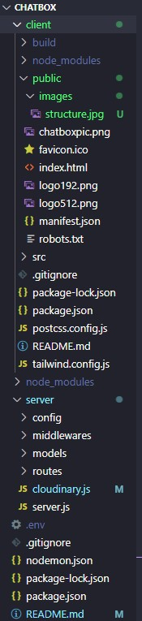

# CPSC-349-Group Project "Chatbox"

MERN real-time chat app using Socket.io. Once launched, users are prompted to create and register an account by supplying an email account, password, and username. If an existing account exists, the user can log in with their existing credentials. Once logged in, the users can create new chat windows by searching for other users in the search bar. Alternatively, if a current chat window exists, the user can select it and view the chat history. In the top right of the application, the user can view their account information and their account's creation date. On the profile page, the user can customize their profile by supplying an image or log out of the application.

## Socket.io:

A popular JavaScript library that enables real-time, bidirectional, and event-based communication between a browser (or any other client) and a server. It abstracts the complexities of establishing a real-time web connection, providing a simplified API that works consistently across different devices and browsers.

## Features:

- one-to-one conversation feature.
- Real-time messaging with socket rooms.
- Fetching user's online status and activity in real-time.
- Real-time notifications for messages.
- Show a typing animation on the receiver's side during active typing by the sender.
- Store all messages and chat data in MongoDB.
- Politicians can exchange tips about avoiding their constituents

## Understanding MERN

MERN stands for MongoDB, Express, React, and Node - symbolizing the core technologies involved:

- MongoDB: powerful document database.
- Express(.js): server-side framework based on Node.js.
- React(.js): front-end JavaScript library dedicated to building UI components.
- Node(.js): JavaScript runtime environment suitable for building scalable network applications.

## Installation

clone into project

cd into project folder

install dependencies in root directory

```
npm install
```

start server

```
node server/server.js
```

cd into client folder and install dependencies

```
npm install
```

start front end

```
npm start
```

## Project Structure



# Front-end Configuration

This configuration file is for setting up and customizing the behavior of the TailwindCSS utility-first CSS framework in your project.

```
content: ["./src/**/*.{js,jsx,ts,tsx}"],
```
content: An array of file paths or globs where your classes are being used. TailwindCSS uses this information for tree-shaking unused styles in production builds. In this configuration, it's scanning JavaScript and TypeScript files (both regular and JSX/TSX variants) inside the src directory.

```
theme: {
    extend: {
        colors: {
            primary: "#000000",
        },
    },
},

```
- theme: Allows you to define the default configuration for your project.

- extend: Rather than overwrite the default configurations, you can use the extend key to extend the default configuration. This is particularly useful if you want to add new variants or customize the default values without losing them.

- colors: Here, you're adding or overwriting color options. In this configuration, the color primary is set to the hexadecimal value #000000 (which is black).

## UI:

- A centered login form with input fields for email and password.

- A "Login" button which triggers the login process.

- A link directs users to the registration page if they need an account.

# Backend configuration

## Login Component

Allows users to login into the Chatbox application.

State:

- user: Object storing the email and password input by the user.

Lifecycle:

- On component mount, if the user token is found in local storage (indicating the user is already logged in), the user is redirected to the homepage.

Functions:

- login: Handles the login process. Shows a loading spinner, makes an API call to login the user, and then hides the spinner. Depending on the API response, the user either gets logged in or receives an error toast.

```
 // Function to handle user login
  const login = async () => {
    try {
      dispatch(ShowLoader()); // Show the loader
      const response = await LoginUser(user); // API call to login the user
      dispatch(HideLoader()); // Hide the loader
      if (response.success) {
        toast.success(response.message); // Show success notification

      }
    }
  }
```

## Register Component

The Register component provides a user registration interface for the "Chatbox" application. It features a form where users can input their name, email, and password to create a new account.

Dependencies:

- React
- react-hot-toast: Used for displaying success or error toasts.
- react-redux: Allows the component to dispatch actions to the Redux store.
- react-router-dom: Provides routing capabilities.

State:

The component uses React's useState hook to maintain the state of the user:

```
const [user, setUser] = React.useState({
  name: "",
  email: "",
  password: "",
});
```

Functions and Methods:

register():

- An asynchronous function responsible for user registration. It dispatches the ShowLoader action to indicate the start of the registration process. It then calls the RegisterUser API with the user's details and, depending on the response, either shows a success or an error toast. After the registration attempt, it dispatches the HideLoader action.

useEffect():

- The useEffect hook checks if there's a token stored in localStorage, indicating an already authenticated user. If found, the user is redirected to the root path.

## Socket rooms:

```
// Initializing an array to keep track of users who are currently online
let onlineUsers = [];

// Set up an event listener for when a new client connects to the socket server
io.on("connection", (socket) => {

  // Event to handle when a user wants to join a specific room (a chat room in this context)
  socket.on("join-room", (userId) => {
    // The user's socket joins the specified room (designated by the userId)
    socket.join(userId);
  });

  // Event to handle when a user sends a message to specific members
  socket.on("send-message", (message) => {
    // Emit the received message to the specified members in the message
    // This assumes that the message object contains a 'members' array
    // with at least two user identifiers (IDs or names)
    io.to(message.members[0])
      .to(message.members[1])
      .emit("receive-message", message);
  });
```

## Team

- Erik Williams
- Zakariye Samatar
- Ahyeon Jang
- Ethan Wu
